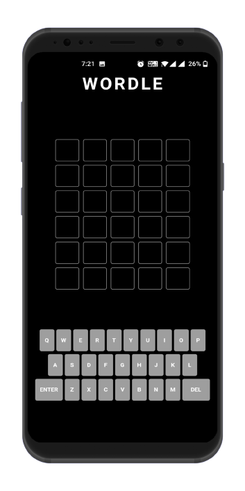
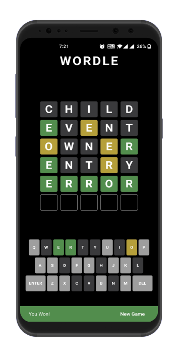

  

# Wordle Game: Guess the Hidden Word

The rules are very simple: You need to guess the hidden word (from 4 to 11 letters) in 6 tries. To get started, just type any word on the first line. If the letter is guessed correctly and is in the correct place, it will be highlighted in green, if the letter is in the word, but in the wrong place - in yellow, and if the letter is not in the word, it will remain gray.
Can you guess the hidden word in 6 tries?

## Tech Stack

**Client:** Flutter

## Demo

Youtube Video : https://youtu.be/blKDDy8WOsQ

## ~Features~ 

- Its Just A Game With No Features

## Libraries

- Main Library Used in App      
    - Flip Tile
    - Equatable

## Screenshots

- All Screens 

Screen 1               |  Screen 2  | 
:-------------------------:|:-------------------------:|
||

## Feedback

If you have any feedback, please reach out to us at dev.adnani26@gmail.com

